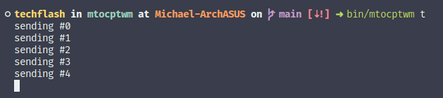
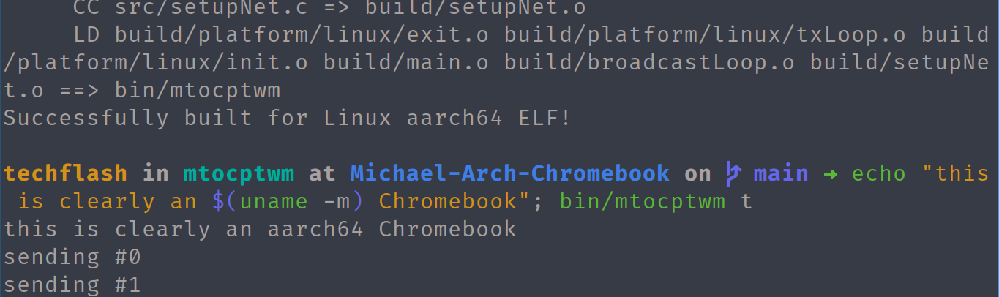
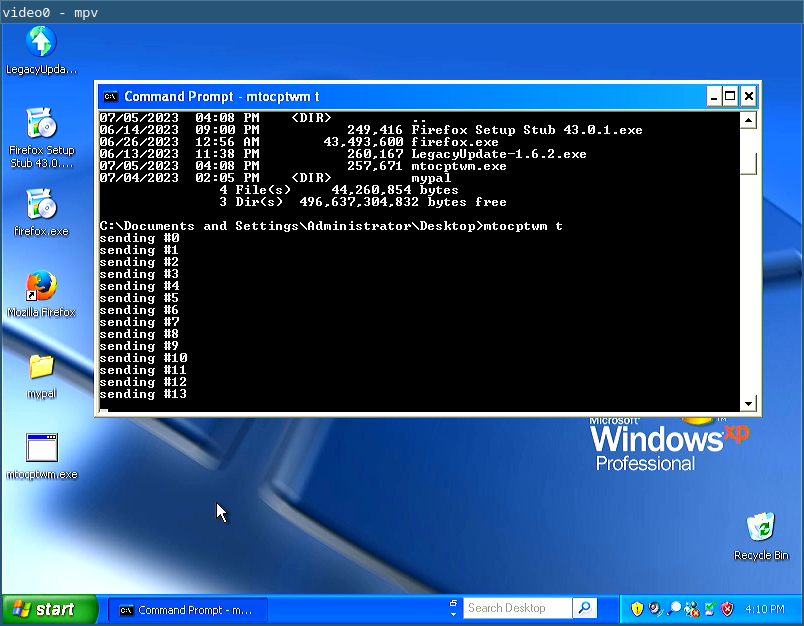

# MTOCPTWM

"Mineman & Techflash’s Overly Complicated Program that can Transfer Windows across Machines"

See [GOALS.md](./GOALS.md) for info on what this project aims to accomplish, what has been completed, and what hasn't.

## Examples

mtocptwm running on an x86_64 Linux desktop  

mtocptwm running on an AArch64 Linux Chromebook  

mtocptwm running on an i386 Windows XP desktop  

mtocptwm running on an AArch64 Nintendo Switch  

